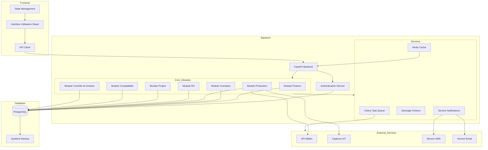

# Diagramme des Composants FOFAL ERP



## Légende des Interactions

### Frontend → Backend
- Requêtes HTTP/HTTPS
- WebSocket pour les mises à jour en temps réel
- JWT pour l'authentification

### Backend → Base de données
- Connexions poolées
- Transactions ACID
- Migrations automatisées

### Services → Services Externes
- API REST
- MQTT pour IoT
- SMTP pour emails
- API SMS

### Flux de Données Principaux

1. **Circuit Production**
   ```
   Capteurs IoT → Production → PostgreSQL → Management → Rapports
   ```

2. **Circuit Finance**
   ```
   Transactions → Finance → Accounting → PostgreSQL → Rapports
   ```

3. **Circuit Inventaire**
   ```
   Production → Inventory → Notifications → Email/SMS
   ```

4. **Circuit RH**
   ```
   HR → Finance → PostgreSQL → Rapports
   ```

## Notes Techniques

1. **Scalabilité**
   - Composants stateless
   - Cache distribué
   - Load balancing possible

2. **Haute Disponibilité**
   - Réplication PostgreSQL
   - Failover automatique
   - Monitoring continu

3. **Sécurité**
   - Authentification multi-facteurs
   - Encryption des données
   - Audit logs
