# Flux de Données et Processus Métier FOFAL ERP

## 1. Processus de Production Agricole

### 1.1 Cycle de Culture du Palmier
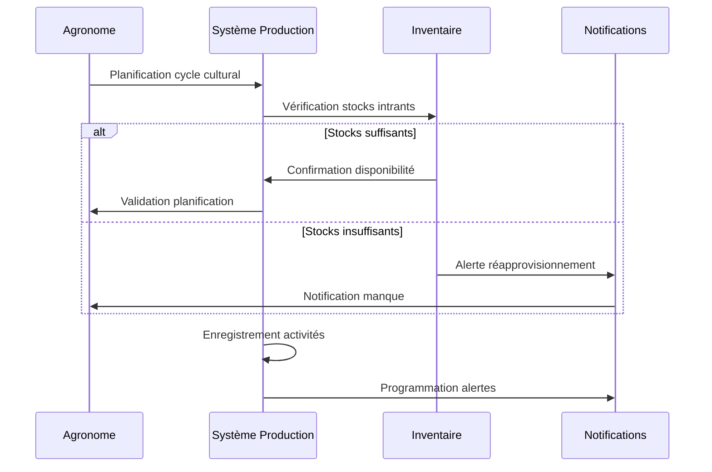

### 1.2 Gestion des Récoltes
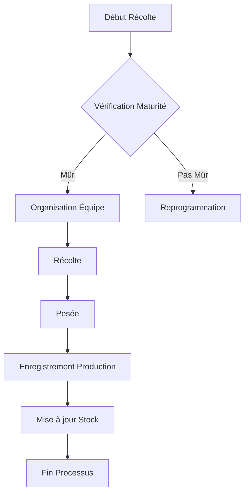

## 2. Processus Financiers

### 2.1 Circuit de Dépense
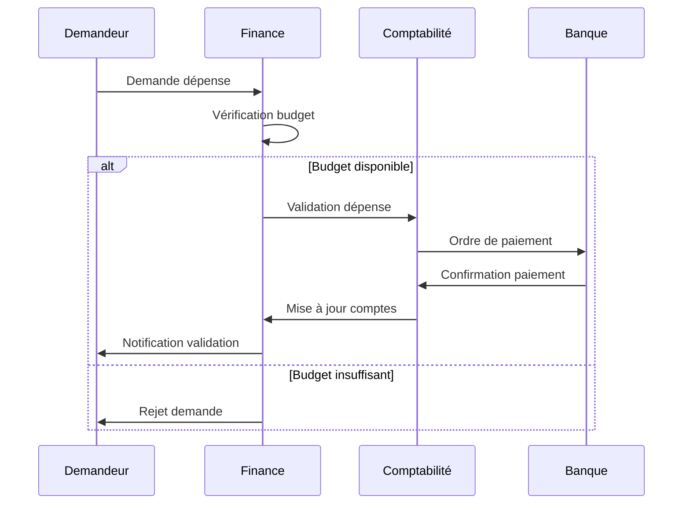

### 2.2 Suivi Trésorerie
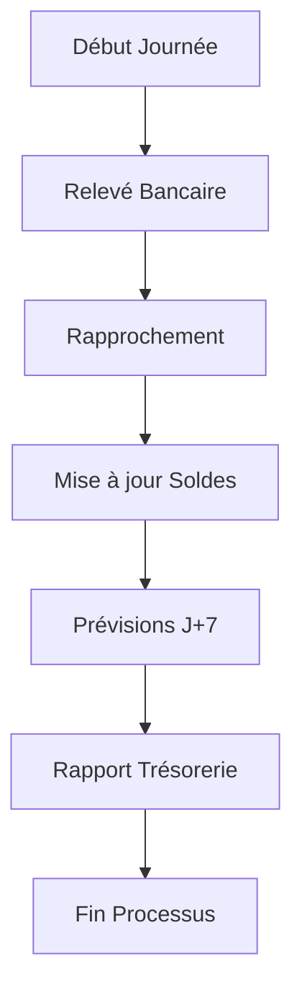

## 3. Processus de Gestion des Stocks

### 3.1 Réapprovisionnement
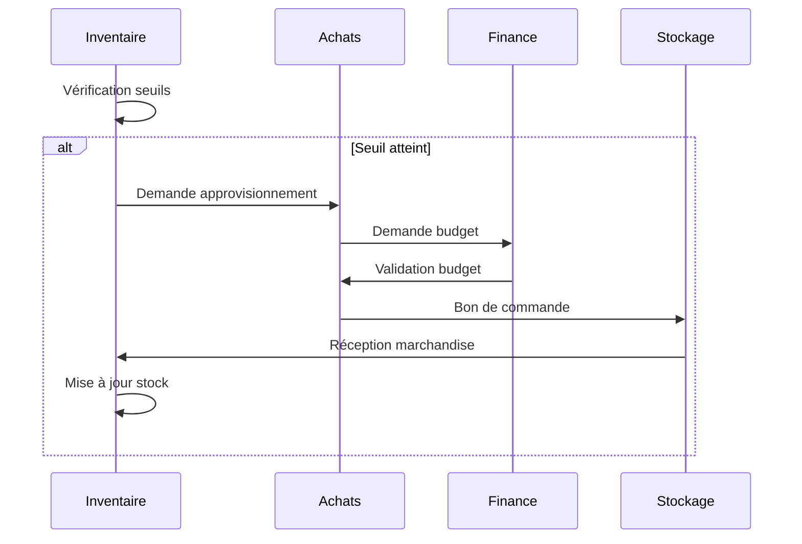

### 3.2 Inventaire Physique
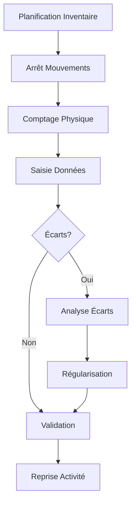

## 4. Processus RH

### 4.1 Gestion des Présences
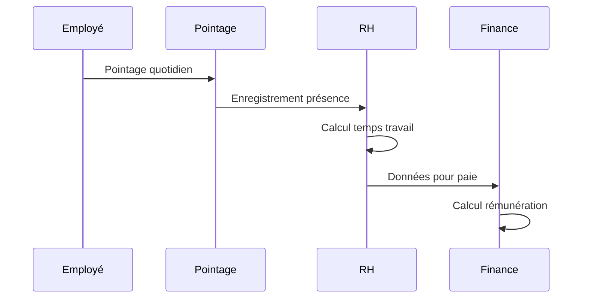

### 4.2 Processus de Paie
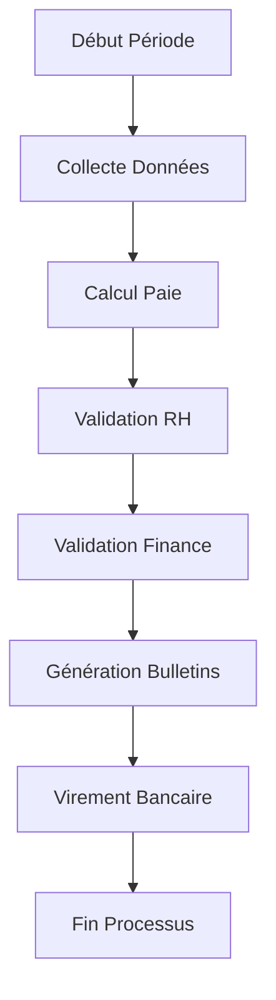

## 5. Processus Comptables

### 5.1 Clôture Mensuelle
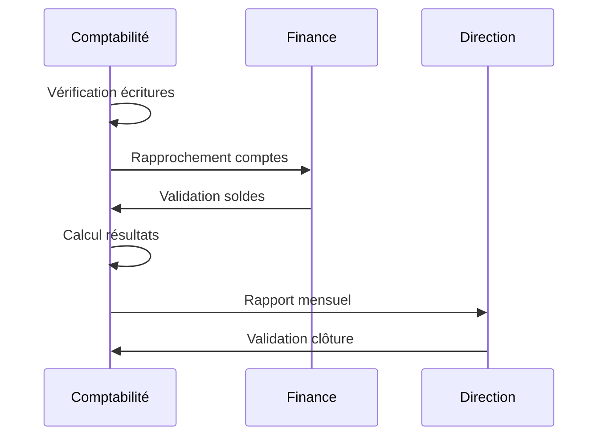

### 5.2 Reporting OHADA
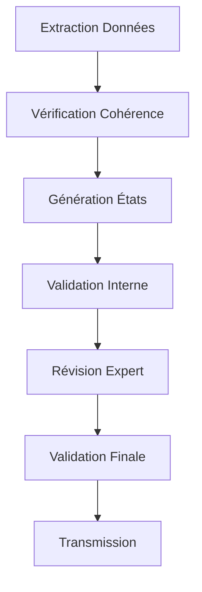

## 6. Processus de Contrôle de Gestion

### 6.1 Suivi des KPIs
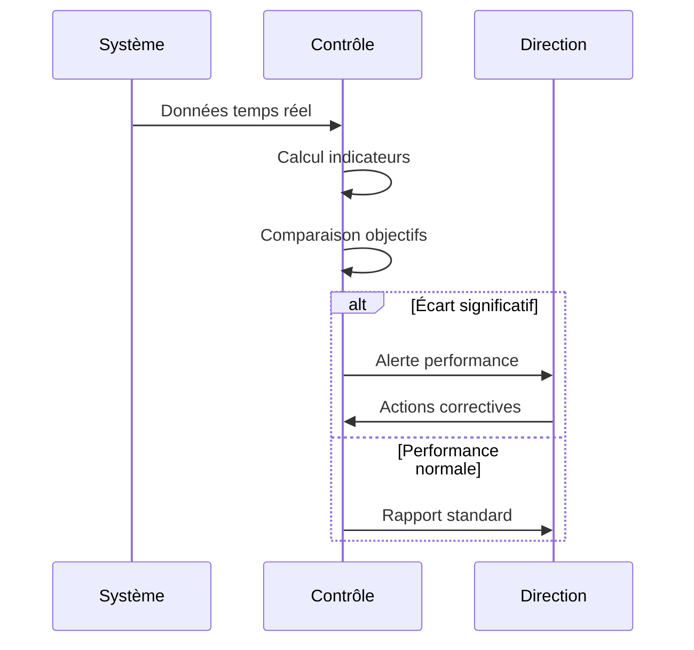

### 6.2 Analyse Coûts
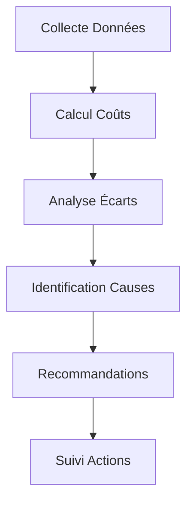

## Notes d'Implémentation

1. **Automatisation**
   - Déclencheurs automatiques pour les alertes
   - Tâches planifiées pour les processus récurrents
   - Validation multi-niveaux configurable

2. **Contrôles**
   - Vérification des contraintes métier
   - Validation des données en temps réel
   - Traçabilité des opérations

3. **Intégration**
   - Synchronisation entre modules
   - Gestion des dépendances entre processus
   - Points de contrôle pour la cohérence

4. **Performance**
   - Optimisation des requêtes
   - Gestion des processus longs
   - Cache des données fréquentes
