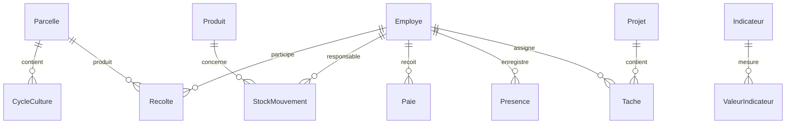

# Modèles de Données FOFAL ERP

## 1. Module Production

### 1.1 Parcelle
```python
class Parcelle:
    id: UUID
    code: str  # Code unique de la parcelle
    culture_type: Enum['PALMIER', 'PAPAYE']
    surface_hectares: Decimal
    date_plantation: Date
    statut: Enum['ACTIVE', 'EN_REPOS', 'EN_PREPARATION']
    coordonnees_gps: JSON
    responsable_id: UUID  # Référence vers Employé
```

### 1.2 CycleCulture
```python
class CycleCulture:
    id: UUID
    parcelle_id: UUID
    date_debut: Date
    date_fin: Date
    rendement_prevu: Decimal
    rendement_reel: Decimal
    notes: Text
```

### 1.3 Recolte
```python
class Recolte:
    id: UUID
    parcelle_id: UUID
    date: DateTime
    quantite_kg: Decimal
    qualite: Enum['A', 'B', 'C']
    equipe_recolte: List[UUID]  # Références vers Employé
    conditions_meteo: JSON
```

## 2. Module Inventaire

### 2.1 Produit
```python
class Produit:
    id: UUID
    code: str
    nom: str
    categorie: Enum['INTRANT', 'EQUIPEMENT', 'RECOLTE']
    unite_mesure: str
    seuil_alerte: Decimal
    prix_unitaire: Decimal
```

### 2.2 StockMouvement
```python
class StockMouvement:
    id: UUID
    produit_id: UUID
    type: Enum['ENTREE', 'SORTIE']
    quantite: Decimal
    date: DateTime
    responsable_id: UUID
    motif: str
    document_reference: str
```

### 2.3 Inventaire
```python
class Inventaire:
    id: UUID
    date: Date
    produit_id: UUID
    quantite_theorique: Decimal
    quantite_physique: Decimal
    ecart: Decimal
    justification: Text
```

## 3. Module Finance

### 3.1 Transaction
```python
class Transaction:
    id: UUID
    date: DateTime
    type: Enum['RECETTE', 'DEPENSE']
    montant: Decimal
    devise: str
    categorie: str
    description: Text
    piece_justificative: str
    statut: Enum['EN_ATTENTE', 'VALIDEE', 'REJETEE']
```

### 3.2 Compte
```python
class Compte:
    id: UUID
    numero: str
    libelle: str
    type: Enum['BANQUE', 'CAISSE']
    solde: Decimal
    devise: str
    actif: bool
```

### 3.3 Budget
```python
class Budget:
    id: UUID
    periode: str  # Format: YYYY-MM
    categorie: str
    montant_prevu: Decimal
    montant_realise: Decimal
    notes: Text
```

## 4. Module Ressources Humaines

### 4.1 Employe
```python
class Employe:
    id: UUID
    matricule: str
    nom: str
    prenom: str
    date_naissance: Date
    poste: str
    departement: str
    date_embauche: Date
    statut: Enum['ACTIF', 'INACTIF']
    contact: JSON
```

### 4.2 Paie
```python
class Paie:
    id: UUID
    employe_id: UUID
    periode: str  # Format: YYYY-MM
    salaire_base: Decimal
    heures_supp: Decimal
    primes: JSON
    deductions: JSON
    net_a_payer: Decimal
```

### 4.3 Presence
```python
class Presence:
    id: UUID
    employe_id: UUID
    date: Date
    type: Enum['PRESENT', 'ABSENT', 'CONGE', 'MALADIE']
    heures_travaillees: Decimal
    notes: Text
```

## 5. Module Comptabilité

### 5.1 EcritureComptable
```python
class EcritureComptable:
    id: UUID
    date: Date
    numero_piece: str
    compte_debit: str
    compte_credit: str
    montant: Decimal
    libelle: str
    periode_comptable: str
```

### 5.2 PlanComptable
```python
class PlanComptable:
    id: UUID
    numero: str
    intitule: str
    classe: str
    type: Enum['ACTIF', 'PASSIF', 'CHARGE', 'PRODUIT']
    niveau: int
```

### 5.3 ExerciceComptable
```python
class ExerciceComptable:
    id: UUID
    annee: int
    date_debut: Date
    date_fin: Date
    statut: Enum['EN_COURS', 'CLOTURE']
    cloture_par: UUID
    date_cloture: DateTime
```

## 6. Module Gestion de Projets

### 6.1 Projet
```python
class Projet:
    id: UUID
    code: str
    nom: str
    description: Text
    date_debut: Date
    date_fin: Date
    budget: Decimal
    statut: Enum['PLANIFIE', 'EN_COURS', 'TERMINE']
    responsable_id: UUID
```

### 6.2 Tache
```python
class Tache:
    id: UUID
    projet_id: UUID
    titre: str
    description: Text
    priorite: Enum['BASSE', 'MOYENNE', 'HAUTE']
    statut: Enum['A_FAIRE', 'EN_COURS', 'TERMINE']
    assignee_a: UUID
    date_debut: DateTime
    date_fin: DateTime
```

## 7. Module Contrôle de Gestion

### 7.1 Indicateur
```python
class Indicateur:
    id: UUID
    code: str
    nom: str
    description: Text
    unite: str
    formule: str
    frequence: Enum['QUOTIDIEN', 'HEBDOMADAIRE', 'MENSUEL']
```

### 7.2 ValeurIndicateur
```python
class ValeurIndicateur:
    id: UUID
    indicateur_id: UUID
    periode: str
    valeur: Decimal
    objectif: Decimal
    commentaire: Text
```

## Relations entre les Modèles



## Notes d'Implémentation

1. **Types de Données**
   - Utilisation d'UUID pour les identifiants
   - Decimal pour les valeurs monétaires et quantités
   - JSON pour les structures flexibles
   - Enum pour les valeurs prédéfinies

2. **Contraintes**
   - Clés étrangères avec suppression en cascade où approprié
   - Contraintes d'unicité sur les codes et références
   - Validation des dates (fin > début)
   - Contraintes de non-négativité sur les montants

3. **Indexation**
   - Index sur les clés étrangères
   - Index composites pour les recherches fréquentes
   - Index sur les dates pour les périodes

4. **Audit**
   - Timestamps created_at/updated_at sur toutes les tables
   - Tracking des modifications (created_by/updated_by)
   - Soft delete où approprié
